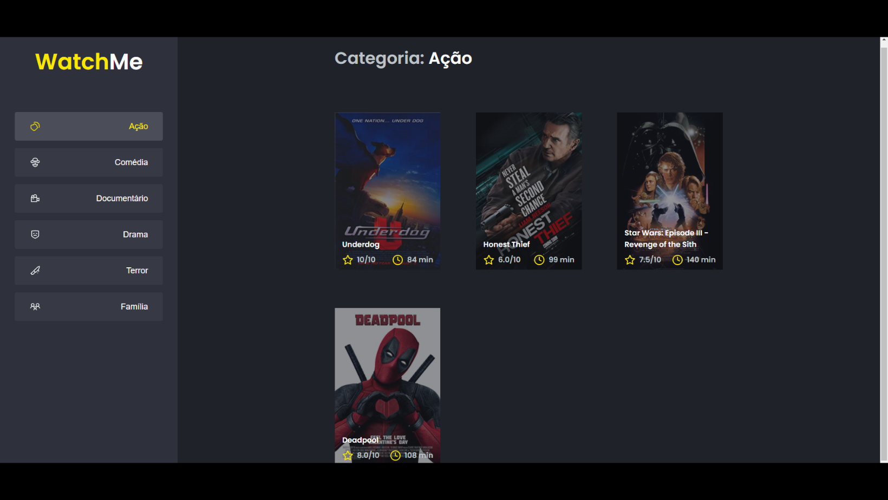

# Watch Me

### This Application was developed in Ignite -  Rocketsteat's course.
## [ReactJS](https://reactjs.org/) + [Context](https://reactjs.org/docs/context.html)

## Features
This project contains a list of movies by category with two components: A Sidebar and Content component.


## Screenshots



## ⛏ Tools

<ul>
<li>React Hooks</li>
<li>Context</li>
<li>Axios</li>
<li>Typescript</li>
<li>Sass</li>
</ul>

# Installation

## 1. Clone this repo

```git clone https://github.com/alanhcrdz/watch-me```
## 2. Go to project folder
```cd watch-me```

## 3. Install dependencies

```yarn```</br>

## 4. Start Json server
```yarn server```

## 5. Start application
```yarn dev```